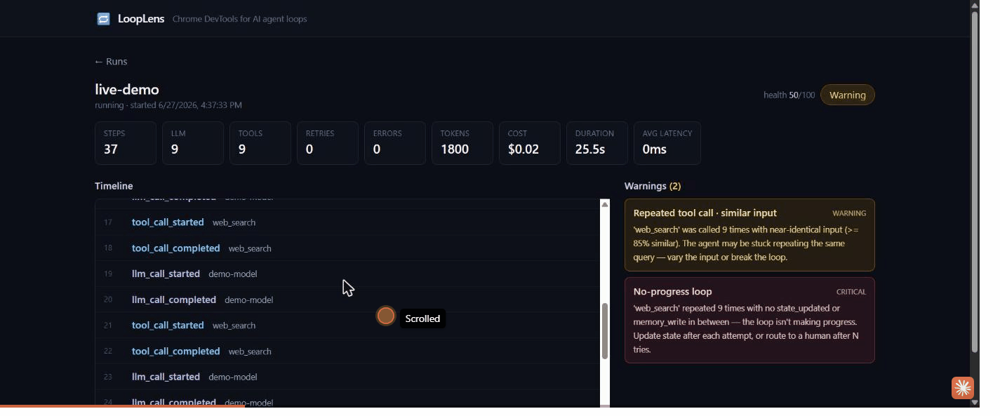

# LoopLens

[](https://github.com/ashutosh-rath02/looplens/actions/workflows/ci.yml)

**Chrome DevTools for AI agent loops.** A local-first, real-time debugger that
shows your agent's execution live and warns when it repeats itself, burns
tokens, retries blindly, or stops making progress.

LoopLens gives you:

- live timeline of agent execution
- LLM-call and tool-call visibility
- retry and handoff tracking
- token and cost metrics
- loop warnings (repeated tool, no-progress, retry storm, cost spike, …)
- JSONL import/export
- a local-first UI — no login, no cloud, no API key

## See it in action

A looping agent calls `web_search` over and over. As events stream in live, the
metrics climb and LoopLens flags **Repeated tool call** and **No-progress loop**
— the warning counts track the repeat count in real time, and the health score
drops to *Warning*.



## Drop it into any project

LoopLens is **not a standalone app you rebuild your agent inside**. It's a tiny
SDK you add to the agent you already have, plus a dashboard you open when you
want to look.

```python
from looplens import trace, event

with trace("research-agent"):
    event("tool_call_started", tool="web_search", input={"query": "AI agents"})
    event("tool_call_completed", tool="web_search", output={"results": 5})
```

Or wrap a function with `@observe` to capture inputs, outputs, latency, and
errors automatically:

```python
from looplens import observe

@observe(kind="tool")
def web_search(query):
    ...
```

The base install is **pure-stdlib with zero third-party dependencies**, so it
won't conflict with anything in your agent's environment. Events are sent from a
background thread (your loop never blocks). If the dashboard is running, events
stream to it live; if not, the SDK buffers to a local JSONL file and **never
crashes your app**.

Configure via environment variables:

```bash
LOOPLENS_ENDPOINT=http://127.0.0.1:8765   # where the dashboard listens
LOOPLENS_ENABLED=true                      # set false to make the SDK a no-op
LOOPLENS_PROJECT=default
LOOPLENS_CAPTURE_INPUTS=true
LOOPLENS_CAPTURE_OUTPUTS=true
LOOPLENS_TRACE_DIR=looplens-traces         # JSONL fallback location
```

## Install

```bash
pip install looplens             # the SDK (drop into your agent — zero deps)
pip install "looplens[server]"   # adds the dashboard (FastAPI + prebuilt UI)
```

That's it — **no Node, no npm, no build step.** The `[server]` extra ships the
compiled React dashboard inside the wheel, so `looplens dev` serves a ready UI on
the first run. (`pipx install "looplens[server]"`, `uv pip install`, and
`uv tool install` work the same way.)

### Works with any agent or framework

The base `looplens` SDK is **pure Python stdlib with zero third-party
dependencies**, so it installs cleanly next to any agent stack and pins nothing:

- **LangGraph / LangChain**, **CrewAI**, **AutoGen**, **OpenAI Agents SDK**,
  **Pydantic AI**, or a hand-rolled `while` loop — if it's Python, you can
  instrument it with `trace()` / `event()` / `@observe`.
- No API key, no login, no network egress — events go to `127.0.0.1` only, and
  the SDK is a no-op when `LOOPLENS_ENABLED=false`.
- Fail-silent by design: if the dashboard isn't running it buffers to JSONL and
  **never raises into your agent**.

## Quickstart

```bash
pip install "looplens[server]"
looplens dev      # start backend + prebuilt UI on http://localhost:8765
looplens demo     # run a sample looping agent that trips a warning
```

Open <http://localhost:8765> and watch the run appear live.

## Architecture

```
Your agent app ──(looplens SDK)──▶ Local FastAPI server ──▶ SQLite
                                          │
                                          └──(live stream)──▶ React UI
```

- **SDK** (`looplens`): `trace()` + `event()`, background HTTP send, JSONL
  fallback, fail-silent. Zero third-party deps.
- **Server** (`looplens[server]`): FastAPI + SQLite + Pydantic, loop detectors,
  metrics, real-time stream.
- **UI**: React + Vite + TypeScript + Tailwind.

## Examples

Runnable agents under `examples/` exercise the detectors. Start the dashboard
(`looplens dev`), then run any of them:

```bash
python examples/simple_agent.py         # a healthy run — no warnings
python examples/looping_agent.py        # repeated tool call + no-progress loop
python examples/retry_storm_agent.py    # retry storm
python examples/handoff_bounce_agent.py # two agents ping-ponging handoffs
```

`looplens demo` runs the looping agent without needing the file checked out.

`examples/real_research_agent_openai.py` is a **real** agent — it makes live
OpenAI calls (function calling) against a tiny corpus that lacks the answer, so
the model genuinely loops. Needs `pip install openai` and `OPENAI_API_KEY`
(optionally `OPENAI_MODEL`):

```bash
OPENAI_API_KEY=sk-... PYTHONPATH=. python examples/real_research_agent_openai.py
```

## Build status

This repo is being built phase by phase (see `PRD.md` section 24).

- [x] **Phase 0** — repo scaffold, packaging, config
- [x] **Phase 1** — FastAPI backend + SQLite + API routes + metrics
- [x] **Phase 2** — Python SDK (`trace` / `event` / `@observe`, background sender, JSONL fallback)
- [x] **Phase 3** — CLI (`init / server / ui / dev / watch / import / export / demo`)
- [x] **Phase 6** — loop detection rules (repeated tool, similar input, no-progress, retry storm, long step, cost spike)
- [x] **Phase 4** — React UI (runs list, run detail, live timeline, metrics bar, warnings, event drawer)
- [x] **Phase 5** — real-time streaming (SSE: live events + metrics + warnings)
- [x] **Phase 7** — polish, examples, demo

## Running from source

The published wheel ships the prebuilt dashboard, so end users never touch Node.
Building **from a git checkout** is the only time you need npm — once, to compile
the UI into the Python package:

```bash
pip install -e ".[server]"            # backend + CLI
npm --prefix ui install               # one-time UI deps
npm --prefix ui run build             # compiles the React bundle into looplens/server/_ui/
python -m looplens.server             # or: looplens server  (serves API + UI)
looplens demo                         # seed a looping run that trips warnings
```

Open `http://localhost:8765` for the dashboard. The backend serves the bundled UI,
so it's a single URL. For UI development with hot reload, run `npm --prefix ui run
dev` (Vite on :5173, proxies `/api` to the backend). Interactive API docs are at
`http://localhost:8765/docs`.

Packaging a release: run `npm --prefix ui run build` first, then `python -m build`
— the wheel force-includes `looplens/server/_ui/` so it's installable with zero
Node.

## How loop detection works

Detection is **rule-based and transparent** (PRD §17) — no black-box scoring. On
every event the backend re-scans the run and raises (or updates) warnings:

| Warning | Fires when |
| --- | --- |
| `repeated_tool_call` | same tool ≥3× within the last 8 **tool calls** (window slides over tool calls, not raw events, so interleaved ReAct traces still trip it) |
| `repeated_tool_call_similar_input` | same tool ≥3× with ≥85% similar input |
| `no_progress` | a tool repeats with no `state_updated` / `memory_write` between calls |
| `retry_storm` | `retry_triggered` ≥3× in the run |
| `long_running_step` | a step over 30s |
| `cost_spike` | one event > 50% of run cost so far (above a $0.05 floor) |
| `handoff_bounce` | control ping-pongs between the same two agents (A→B→A→B) |

Each warning carries a health penalty; the run's score (0–100) maps to
**Healthy / Warning / Likely stuck / Failed**.

## Limitations (MVP)

- **Manual instrumentation only.** Framework adapters (LangGraph, OpenAI Agents
  SDK, CrewAI) are on the V1 roadmap; today you call `trace()`/`event()`/`@observe`.
- **Rule-based detection**, not semantic — similar-input uses string similarity,
  not embeddings.
- **Near-real-time, not push**: the SSE stream polls SQLite every ~0.5s.
- **Single local user, no auth** — local-first by design, not a production service.

## Tests

```bash
pip install -e ".[dev]"
pytest -q          # SDK resilience, all seven detectors, and the SSE stream
```

## Roadmap

See [`ROADMAP.md`](ROADMAP.md) for what's next — PyPI release, CI, and framework
adapters (LangGraph, OpenAI Agents SDK, CrewAI) to remove manual instrumentation.
Launch copy lives in [`LAUNCH.md`](LAUNCH.md).

## License

MIT
