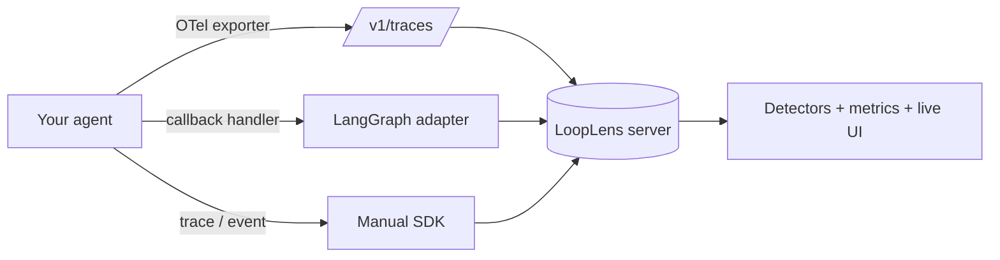

# Framework integration

LoopLens is **not a standalone app you rebuild your agent inside.** You add it to
the agent you already have. There are three ways to do that, from
zero-instrumentation to full manual control.

## Pick an approach

### 1. OpenTelemetry — universal, zero code

Most agent frameworks — **LangChain/LangGraph, LlamaIndex, CrewAI, AutoGen, the
OpenAI Agents SDK**, and more — can emit OpenTelemetry spans via the
[OpenInference](https://github.com/Arize-ai/openinference) or
[OpenLLMetry](https://github.com/traceloop/openllmetry) instrumentations. Point
their OTLP exporter at LoopLens and the spans become runs, events, and loop
warnings with **no LoopLens-specific code in your agent**.

→ [OpenTelemetry ingestion](opentelemetry.md)

### 2. LangGraph adapter — tight, in-process

A single LangChain callback handler that captures every node's LLM and tool
calls. One line in your run config.

→ [LangGraph adapter](langgraph.md)

### 3. Manual SDK — full control

Call `trace()` / `event()` / `@observe` yourself. Best for hand-rolled loops or
when you want to emit exactly the events you care about.

→ [Manual SDK](sdk.md)

## Which should I use?

| You have… | Use |
| --- | --- |
| Any framework with an OpenInference/OpenLLMetry instrumentor | **OpenTelemetry** |
| A LangGraph or LangChain app | **LangGraph adapter** (or OpenTelemetry) |
| A hand-rolled loop, or a framework with no instrumentor | **Manual SDK** |

All three funnel through the **same** ingestion pipeline, so the
[loop detectors](detectors.md), health scoring, and live UI work identically no
matter how the events arrived.
